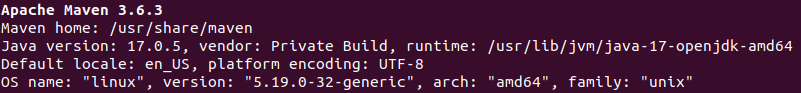
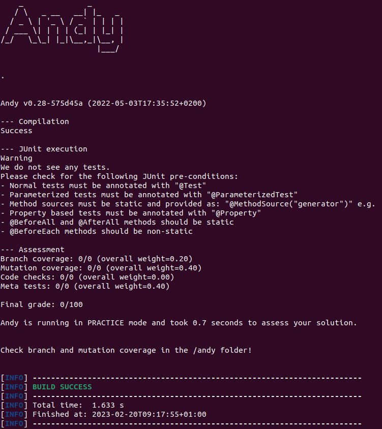

# TEST INFOM124 - Software verification and validation
## Practical courses - 2022-2023

This repository contains all the exercises of the "INFOM124 - Vérification et validation logicielle". To use this repository locally, you have to [clone it](https://docs.github.com/en/repositories/creating-and-managing-repositories/cloning-a-repository) to your own machine.

## Requirements

All the requirements discussed in this section refer to Linux or macOS distributions. If you are on Windows 10, you can install a Linux kernel so that you can use the same command lines as Linux or macOS, by following [this tutorial](https://www.ssl.com/fr/comment/activer-le-sous-syst%C3%A8me-linux-installer-ubuntu-windows-10/).

### Java

JDK 17 (or openJDK 17) is required for all the exercises. Here are the steps of installation of openJDK 17 on Linux and macOS distributions (for Windows, see [this tutorial](https://java.tutorials24x7.com/blog/how-to-install-openjdk-17-on-windows)).

Installation:
```console
sudo apt update
sudo apt install openjdk-17-jdk openjdk-17-jre
```

Check the successful installation:
```console
java --version
```

If the returned version is openjdk 17, the installation is complete!

### Maven

All the exercises in this repository use Maven.

> "Apache Maven is a software project management and comprehension tool. Based on the concept of a project object model (POM), Maven can manage a project's build, reporting and documentation from a central piece of information."
> -- <cite>[Apache Maven website](https://maven.apache.org/)</cite>

Maven should be installed on your computer. There are two possibilities:
1. Command line: check the [Maven website](https://maven.apache.org/install.html) (or [this tutorial for Windows](https://phoenixnap.com/kb/install-maven-windows)) for installation.
2. Maven integration with your IDE: check in function of the IDE you use

After the installation is complete, run:
```console
mvn -v
```

The result should be similar to the image below. Make sure the Java version is 17!


### Testing the installation

After the installation is complete, open one of the exercise folder (`substringsBetween` for example). Let's run `andy` through the command line for this example. Once you are on the exercise folder, on the same directory the `pom.xml` file is in, run:
```console
mvn andy:run
```

After a few seconds, if everything goes well, the build is done and you can see something similar to the image below. If you have the same result, all your configuration is done for the course!
> NB: The messages you are seeing in this example tell you that the project has not tests. This is normal as we haven't tested anything... yet!



## Structure of an exercise

Each practical course has its folder containing each exercise made during the practical courses. These exercises follow the same basic structure. Every exercise contains two or three folders: `config`, `solution` and `src`. The `solution` folder will be pushed on the repository after the related course is finished. The folders have the following functionality:
- `config`: contains a `Configuration.java` file, which is used by `andy` for grading your exercise. You do not have to change this.
- `solution` (after the related course is finished): contains a `ExerciseNameTest.java` file, which is a solution to the exercise.
- `src`: contains two files, `ExerciseName.java` and `ExerciseNameTest.java`. The file without `Test` is the file that you need to test. **The file including `Test` is the file where you have to write your solution**.

For `andy` to work properly, you should not add any other files to the exercises. If you add any files, we cannot guarantee it will work correctly.

## Grading an exercise

Grading an exercise goes through the command line or through a Maven plugin (in function of the installation you made in the [Requirements](#requirements) section). Either way, Maven will use [Andy](https://github.com/cse1110/andy), a tool that runs a set of checks and metrics and provides feedback to the user.

### Command line

You have to ensure that you are on the same directory the `pom.xml` file is in.
> The `pom.xml` is the configuration file of a maven project.

If you are in that directory, you can just run:
```console
mvn andy:run
```
This will output your errors, results and grades to the console. The first time you run this command, maven will download lots of data, this is normal.

### Maven Plugin

If you have a Maven Plugin integration with your IDE, you would only have to look for the plugins under the category `andy` and run the `andy:run` plugin. This will run Andy in a new window and print the errors, results and grades here.
