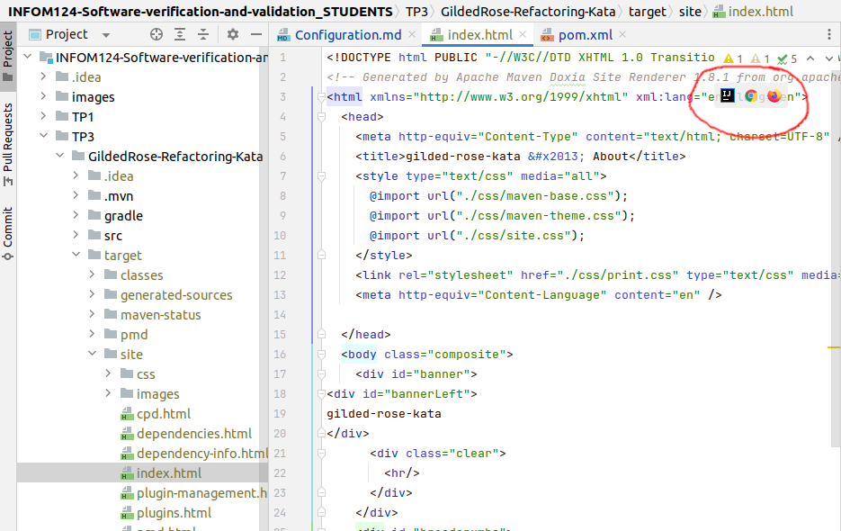
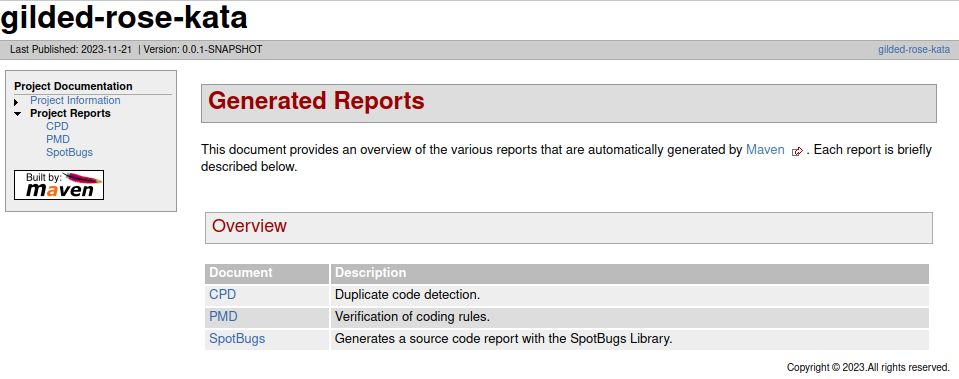

# Refactoring course

Ce TP sera centré sur le refactoring de code. L'objectif est de répondre aux exigences du projet GildedRose-Refactoring-Kata (voir le README présent dans le dossier du projet). Veillez à ouvrir ce dossier dans IntelliJ et à utiliser Maven lors de la configuration (il vous sera demandé de choisir entre Maven et Gradle).

Il y a un certain nombre de code smells dans ce projet. Ces codes smells sont décrits sur [ce site](https://sourcemaking.com/refactoring). Identifiez-les et résolvez ces problèmes tout en répondant aux exigences décrites dans le README du projet. Bonne chance!


# Static analysis of source code

During this practical course, we're going to make static analysis of your refactoring code with a number of tools: SonarQube, PMD, SpotBugs and JaCoCo. The following sections explain how to download and install these tools. Enjoy!

## Docker

> Docker is a platform designed to help developers build, share, and run modern applications. We handle the tedious setup, so you can focus on the code.
> -- <cite>[Docker website](https://www.docker.com/)</cite>

Docker will be useful for installing SonarQube on your computer.

### Installation

You can download and install Docker Desktop here: [https://www.docker.com/products/docker-desktop/](https://www.docker.com/products/docker-desktop/)

Please, follow [this "getting started" tutorial](https://www.docker.com/blog/getting-started-with-docker-desktop/) to verify your installation.

> **Note for Ubuntu users**: you can follow these informations if you prefer not using Docker Desktop: [https://doc.ubuntu-fr.org/docker](https://doc.ubuntu-fr.org/docker).

### Some commands

Some docker commands to remember:
- Stop the container:
```console
docker stop <name of the container>
```
- Start the container:
```console
docker start <name of the container>
```

- Restart the container:
```console
docker restart <name of the container>
```

## SonarQube

> SonarQube is a self-managed, automatic code review tool that systematically helps you deliver clean code. As a core element of our Sonar solution, SonarQube integrates into your existing workflow and detects issues in your code to help you perform continuous code inspections of your projects.
> -- <cite>[SonarQube website](https://docs.sonarqube.org/latest/)</cite>

### Local server installation and analysis of a project

Requirements: docker and Maven installed.

> **Note**: you may need administrator privileges to make the below commands working!

1. Terminal command to get the SonarQube docker (from [https://hub.docker.com/_/sonarqube](https://hub.docker.com/_/sonarqube)):
```console
docker pull sonarqube
```
2. Terminal command to create and start the docker:
```console
docker run -d --name sonarqube -p 9000:9000 -p 9092:9092 sonarqube
```
> **Note**: the above command should be used once! After the creation of the container, you will have to use the commands described in the [Docker](#some-commands) section.

3. After the start of the docker, go to `http://localhost:9000`, login with `admin` and `admin` credentials and update your password.
4. The platform asks you "How do you want to create your project?". Select "Create a local project"
5. Give your project a name and select "Next"
6. Click on "Use the global setting" and create your project
7. Click on "Locally" when SonarQube asks how to analyze your repository
8. Generate a project token and click on "Continue"
9. When SonarQube asks for your type of build, select `Maven`
10. SonarQube will give you a terminal command to run sonar on a project. Keep it safe somewhere as you will need it. The command looks like something like this:

```console
mvn clean verify sonar:sonar \
  -Dsonar.projectKey=test-sonar \
  -Dsonar.host.url=http://localhost:9000 \
  -Dsonar.login=sqp_6028bd54b089.....899d405de2159436feec
```

10. This command will not be enough to run sonar on our project. We have to add this line at the end of the command: `-Pcoverage` so that we can have the code coverage values in sonar. This gives us the entire command to analyze your project:
```console
mvn clean verify sonar:sonar \
  -Dsonar.projectKey=test-sonar \
  -Dsonar.host.url=http://localhost:9000 \
  -Dsonar.login=sqp_6028bd54b089.....899d405de2159436feec
  -Pcoverage
```

11. To start analyze a Java Maven project with SonarQube, go to the root of the project (not the directory of the course!!) and execute the terminal command above. This will run the Maven project and link it to SonarQube analysis.
> **NOTE:** each time you modify the code, you will need to rerun this command to make the changes effective.
12. Go to `http://localhost:9000` and enjoy!


### SonarLint plugin on Intellij (optional)

> SonarLint is a free IDE extension to find and fix coding issues in real-time, flagging issues as you code, just like a spell-checker. More than a linter, it also delivers rich contextual guidance to help developers understand why there is an issue, assess the risk and educate them on how to fix it. This helps improve their skills, enhance their productivity, and take ownership of their code, taking linting to a different level.
> -- <cite>[JetBrains website](https://plugins.jetbrains.com/plugin/7973-sonarlint)</cite>

SonarLint can be installed on Intellij to see code smells, bugs and so on while you are coding. See the plugin settings on Intellij to install it.

It also can be linked with SonarQube (it is mainly used in a CI/CD context). To get more informations about this, go to [https://docs.sonarqube.org/9.6/user-guide/sonarlint-connected-mode/](https://docs.sonarqube.org/9.6/user-guide/sonarlint-connected-mode/).


## PMD Source Code Analyzer Project, Spotbugs and JaCoCo tools

### Definition of each tool

#### PMD
> PMD is a static source code analyzer. It finds common programming flaws like unused variables, empty catch blocks, unnecessary object creation, and so forth.
> -- <cite>[PMD website](https://docs.pmd-code.org/latest/index.html)</cite>

#### SpotBugs
> SpotBugs is a program which uses static analysis to look for bugs in Java code.
> -- <cite>[Spotbugs website](https://spotbugs.github.io/)</cite>

#### JaCoCo
> JaCoCo is a free code coverage library for Java, which has been created by the EclEmma team based on the lessons learned from using and integration existing libraries for many years.
> -- <cite>[JaCoCo website](https://www.jacoco.org/jacoco/)</cite>

### PMD rules

Here is some information about the rules followed by PMD to find bugs: [https://docs.pmd-code.org/latest/pmd_rules_java.html](https://docs.pmd-code.org/latest/pmd_rules_java.html)

### Usage

The plugins are already placed in the dependencies of the pom file of GildedRose-Refactoring-Kata. If you want to use it for another project, see [this link for PMD](https://docs.pmd-code.org/latest/pmd_userdocs_tools_maven.html), [this link for spotbugs](https://spotbugs.readthedocs.io/en/latest/maven.html) and [this link for JaCoCo](https://www.eclemma.org/jacoco/trunk/doc/maven.html).
1. Run ```mvn clean test site:site``` in the root of your project (aka inside *GildedRose-Refactoring-Kata* directory)
2. Go to */target/site* and open *index.html* in IntelliJ as a local file URL with Firefox, Chrome or with IntelliJ built-in Preview (see screen below)
   
3. Go to *Project Reports* and see the PMD, SpotBugs and JaCoCo reports of your project (see below)
   